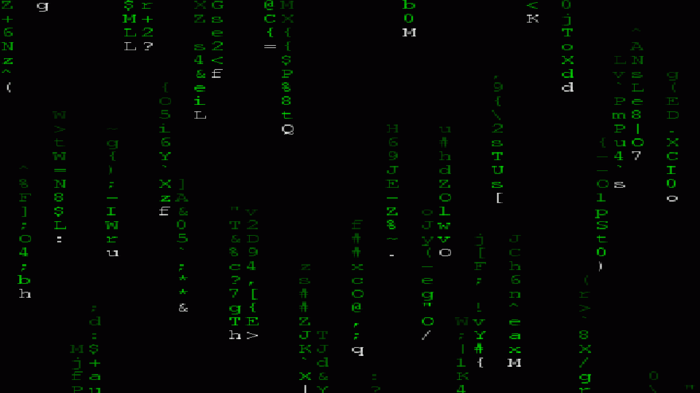

<div align="center">

<!-- ======================= MATRIX TITLE ======================= -->

<table width="100%">
<tr>
<td align="center">



<h1 style="margin-top:-220px; position:relative;">
  <code>> whoami</code>
</h1>

<h1 style="position:relative;">
  DOLEV ASHER
</h1>

<h3 style="position:relative;">
  Computer Science Student • Software Engineer @ Mobileye
</h3>

<br>

<p style="position:relative;">
  <code>Welcome to my GitHub</code>
</p>

</td>
</tr>
</table>

<br>

<!-- ======================= ABOUT ======================= -->

<h2> > ABOUT_ME_</h2>

<p>
🎓 3rd Year B.Sc. Computer Science Student
</p>

<p>
💼 Software Engineer @ <b>Mobileye</b>
</p>

<p>
🧬 Currently working on <b>waypointInterception</b>
using a <b>Genetic Algorithm</b>
</p>

<p>
💡 Interested in algorithms, software engineering,
AI and computer science
</p>

<br>

<!-- ======================= SEPARATOR ======================= -->


<br>

<!-- ======================= GITHUB STATS ======================= -->

<h2> > GITHUB_STATS_</h2>

<br>

<a href="https://github.com/DolevAsher">


</a>

<br><br>

<!-- ======================= SEPARATOR ======================= -->


<br>

<!-- ======================= LANGUAGES ======================= -->

<h2> > LANGUAGES_</h2>

<br>


<br><br>

<table align="center">
<tr>

<td align="center" width="150">

<b>Python</b>

</td>

<td align="center" width="150">

<b>C / C++</b>

</td>

<td align="center" width="150">

<b>Java</b>

</td>

<td align="center" width="150">

<b>VBA</b>

</td>

</tr>
</table>

<br>

<!-- ======================= TOOLS ======================= -->

<h2> > TOOLS_&_TECHNOLOGIES_</h2>

<br>


<br><br>

<table align="center">
<tr>

<td align="center" width="180">

🐧<br>
<b>Linux</b>

</td>

<td align="center" width="180">

🔀<br>
<b>Git</b>

</td>

<td align="center" width="180">

📊<br>
<b>Microsoft Office</b>

</td>

</tr>
</table>

<br>

<!-- ======================= SEPARATOR ======================= -->


<br>

<!-- ======================= CURRENT PROJECT ======================= -->

<h2> > CURRENT_PROJECT_</h2>

<br>

<table align="center">
<tr>
<td align="center">

```text
┌──────────────────────────────────────────────┐
│                                              │
│              waypointInterception            │
│                                              │
│        Genetic Algorithm                    │
│                                              │
│        > optimizing waypoints...             │
│        > evolving solutions...               │
│        > searching solution space...         │
│                                              │
└──────────────────────────────────────────────┘
